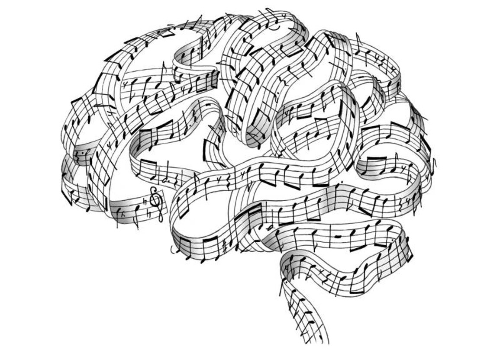

```{r setup, include=FALSE}
library(flexdashboard)
library(ggplot2)
library(plotly)
```

### Low pitch is ***masculine*** and a ***grandmother***?! Sounds fake, but ok… {data-commentary-width=800}

<div align="center"> Firstly, I would like to ask you to **listen** to this short music snippet: \
\
<audio controls>
  <source src="h_3.wav" type="audio/mpeg">
</audio>  <br> \
How would you *describe* this sound? Does it evoke any word associations? Is it, perhaps, *high*? Would you say that it sounds more *blunt* than *sharp* or vice versa? \
\
 </div>


***
**Metaphors** are no strangers to our everyday life. Even without realizing, we use metaphors on a daily basis: *time is money*, *heart made of gold*, *someone being an early bird/night owl*… \
\
Hearing is said to be the most *abstract sense* out of the human senses, so naturally, listening to music is quite a *unique experience*. That is why we tend to borrow words and metaphors that originate from other senses to talk about music. \
\
If you are still reading this text, it is safe to assume that you are a proficient speaker of English. Then, you are probably familiar with **high-low** metaphor that is widely used in English, among other European languages such as *Russian* and *Dutch*, to describe sounds of opposite pitch. Interestingly, although this verticality metaphor seems to be the *prevalent* one, it is **not universal** across all 6,500+ languages that exist. \
\
For instance, in *Balinese* (spoken in Bali), pitch is **small** or **large**. In *Gbaya* language family, that consists of dozen various languages from the western Central African Republic, pitches are arranged *genealogically*, so high pitch would be called a **daughter** and low pitch would be called a **grandmother**. Alternative metaphors include **feminine – masculine**, **rough – smooth**, **thin – thick**, among others. \
\
All of these diverse metaphorical pitch descriptions might sound *foreign* and a *bit baffling*. But what if I told you that you would probably apply these metaphors to high- and low-pitched sounds in the same way as a native speaker? That is, if presented with a low-pitched sound (imagine something like a *heavy bass* sound), you would be more likely to describe it as **masculine**, **smooth** and a **grandmother** than **feminine**, **rough** and a **daughter**. \
\
Even if it sounds far-fetched at this point, I invite you to **click through the dashboard** and see how I investigated *whether foreign metaphors are applied correctly by English speakers*!

### Sounds and Metaphors: Investigation through a Survey {data-commentary-width=900}


***

With this research, I wanted to check whether the crosslinguistic metaphors are applied to high- and low-pitched sounds in the same way as they are in the language of origin. To test that, English-speaking participants were asked to listen to a high- or low-pitched instrumental music excerpts and judge whether the word presented on the screen afterwards is related or unrelated to the sound. Please feel free to take a demo version of the survey by scanning the QR code on the left or clicking the [link](https://uvacommscience.eu.qualtrics.com/jfe/form/SV_eEFlcMixKZ2fP4W)! \
\
Also, in theory, participants should answer the relatedness question faster when presented with a matching sound-metaphor pair. To illustrate, when one reads or hears the word dog, other words associated with dog, such as leash, cat, food, come to mind, not puzzle, case and gum. Same principle can be applied to music: if you hear a piccolo (one the highest-pitched instruments) solo and the see word thin, you should be able to categorize the word as ‘related to the sound’ without thinking too much about it. Conversely, if you see the word thick, it might require more time to process whether the word is really related or not. \

### Results: Accurate, but not Fast. What Does it Mean? {data-commentary-width=900}

```{r}

```

***

The results indicated that people are most accurate in rejecting wrong combinations of language and sound. That means that after listening to a high-pitched sound, words like masculine and smooth were deemed to be irrelevant to the musical excerpt and vice versa. Unfortunately, the speed with which participants judged matching and mismatching sound-word combinations did not differ much. \
\
Strong agreement among participants on what is a right word and what is a wrong word to describe a high/low-pitched sound indicates that all of these seemingly foreign metaphors might actually exist in our brain, even though we do not use them in English. This finding also provides evidence for the claim that such metaphorical associations of pitch might be innate, that is something we are born with. The fact that people took approximately the same time to accept and reject words shows that although we tend to judge correctly, we are not very efficient in judging music-word pairs. Even though music can evoke particular word associations (high-pitched sound → thin), they might not be as strong as word-word (girl → feminine) ones.  However, figuring out the precise mechanisms behind how perception of pitch and thoughts interact is a puzzle to solve for future researchers.